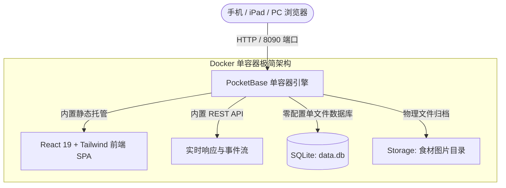

<div align="center">


# 🍱 ChowTime (饭点)

**现代化家庭菜谱管理 · 大人菜/宝宝辅食双轨分类 · 烹饪指引与每日美食打卡 · 超轻量单容器私有化中枢**

[](https://opensource.org/licenses/MIT)
[](https://pocketbase.io)
[](https://react.dev)
[](https://www.docker.com)
[](https://tailwindcss.com)

</div>

---

## 📖 项目简介

**ChowTime (饭点)** 是一款专为中国家庭打造的私有化、轻量级菜谱管理与烹饪打卡应用。

在快节奏的生活中，每天最常问的一句话莫过于：*“今天吃什么？”* 

不同于市面上偏西餐化、功能臃肿复杂的传统食谱系统（如 Mealie 等），亦不同于只是一篇排版文档的静态项目，**《饭点》聚焦于真实中国家庭的厨房痛点**——不仅涵盖大人喜欢的经典家常热炒、爽口凉菜与养生靓汤，**更独创了“大人菜”与“宝宝辅食”双轨并行体系**，让带娃家庭能清晰规划宝宝的营养阶段辅食。同时支持做菜步骤倒计时指引、做菜心得评分以及时光打卡记事。

---

## ✨ 核心特性

- 👶 **大人菜 / 宝宝辅食双轨分类**：一键切换视角，家常硬菜与宝宝少油少盐分阶营养餐井井有条。
- 📋 **结构化食材与引导式步骤**：清晰的配料用量清单、分步图文详解，下厨做菜一目了然，不忙不乱。
- 🗓️ **烹饪打卡与家庭美食日记**：记录每天做过的美味佳肴、心得评价与打分，沉淀属于全家人的烟火气记忆。
- 🖼️ **移动端图片裁剪与本地压缩**：内置丝滑的图片裁剪工具（Cropper）与前端自动压缩引擎，随手拍照上传，图片小而清，不挤占 NAS 空间。
- ⚡ **超轻量全栈单容器架构**：后端与数据库基于卓越的 **PocketBase (单个 Go 二进制 + SQLite)** 构建，前端整合为单镜像，**整套系统内存占用仅需 20MB 左右**，启动仅需 0.05 秒！
- 📱 **厨房移动端触控优化**：深度针对手机和 iPad 触屏进行交互适配，方便厨房摆放随时翻看。

---

## 🔄 架构设计与极简技术栈



---

## 🚀 极速部署 (Quick Start)

### 方式 1：使用 Docker Compose（推荐）

1. 创建 `docker-compose.yml` 文件：

```yaml
version: '3.8'

services:
  chowtime:
    image: ghcr.io/davechandev/chowtime:latest # 官方云端镜像 (或本地构建: build: .)
    container_name: chowtime
    restart: unless-stopped
    ports:
      - "8090:8090"
    volumes:
      # 持久化挂载菜谱数据库与上传的食材图片
      - ./data:/pb/pb_data
```

2. 启动容器：
```bash
docker compose up -d
```

3. 打开浏览器访问：`http://你的服务器IP:8090` 即可直接使用！

---

### 方式 2：使用 Docker 命令一行运行

```bash
docker run -d \
  --name chowtime \
  --restart unless-stopped \
  -p 8090:8090 \
  -v ./data:/pb/pb_data \
  ghcr.io/davechandev/chowtime:latest
```

---

## 🔐 管理后台说明 (PocketBase Admin)

容器默认内置了 50 道精选初始家常菜谱和精美图片。若您需要批量管理、备份数据或添加自定义字段：

1. 访问 PocketBase 专属管理后台：`http://你的服务器IP:8090/_/`；
2. 首次访问会提示创建您的第一个专属超级管理员账号（自定义邮箱与密码）；
3. 登录后即可直观管理所有集合表（`recipes`、`cooking_records` 等）。

---

## 📜 菜谱数据来源与知识产权声明 (Disclaimer)

1. 本项目内置以及演示包含的所有菜谱文字、制作步骤、食材配比及图片，均收集自**小红书、下厨房、各大美食博主及公开网络社区**热心厨友的无私分享。
2. 所有菜谱图文内容的知识产权均归**原作者所有**。
3. 本项目为开源公益非营利软件，菜谱内容仅供家庭日常烹饪参考、个人生活记录与技术开发学习，**严禁将本项目内置数据用于任何商业牟利、出版或分发行为**。
4. 若原作者对某些菜谱或图片的使用有异议，请提交 Issue 联系我们，我们将在第一时间协助处理或移除。

---

## 📄 开源许可证 (License)

本项目基于 [MIT License](LICENSE) 协议开源。
