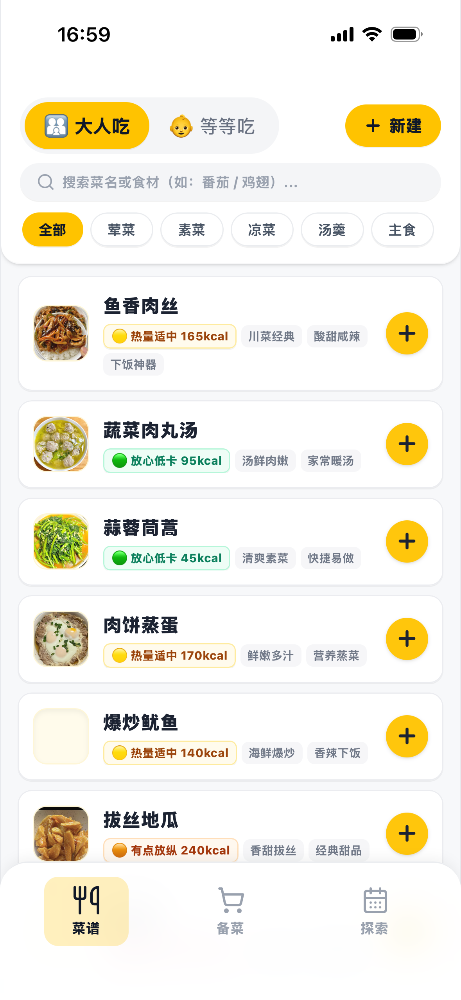
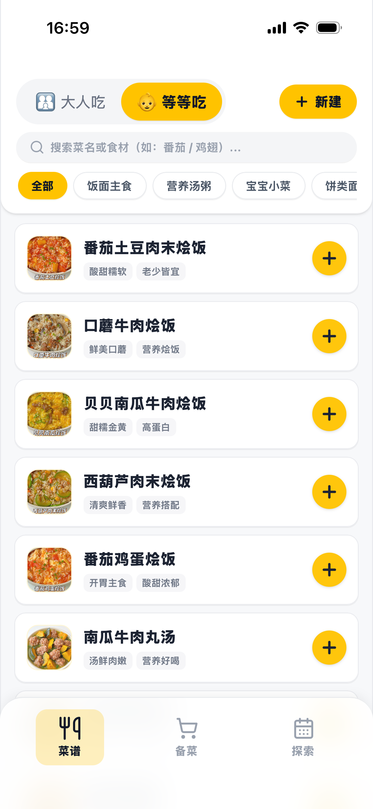
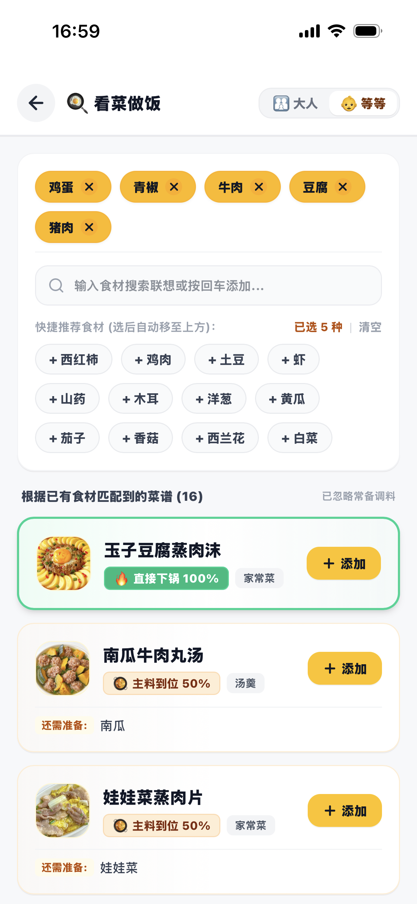
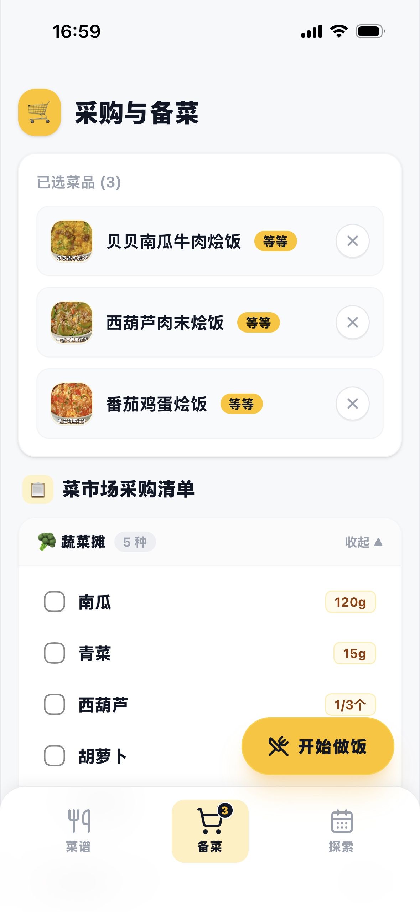
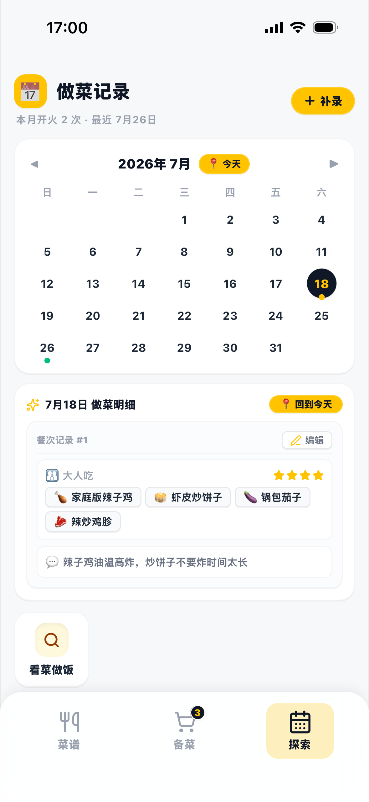
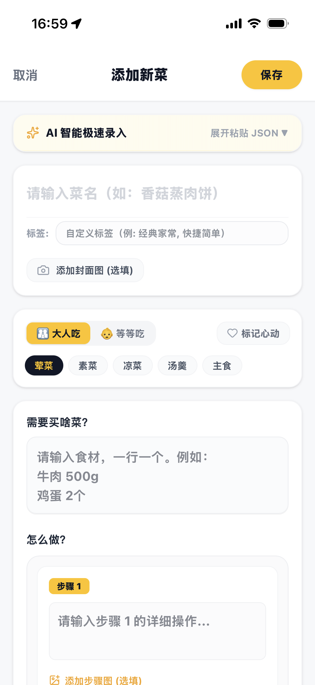

<div align="center">


# 🍲 ChowTime (饭点)

**专为中国家庭打造的现代化私有化菜谱管理 · 大人菜/宝宝辅食双轨分类 · 适老化大字号设计 · 极轻量单容器**

[](https://opensource.org/licenses/MIT)
[](https://pocketbase.io)
[](https://react.dev)
[](https://www.docker.com)
[](https://tailwindcss.com)

<p align="center">
  <a href="#-中文介绍">🇨🇳 中文介绍</a> •
  <a href="#-english-overview">🇺🇸 English Overview</a> •
  <a href="#-极速部署-quick-start">🚀 快速开始</a> •
  <a href="#-核心亮点与设计哲学">✨ 功能亮点</a>
</p>

</div>

---

<div align="center">
  <h3>✨ 温暖烟火气美学 · 贴心适老化交互界面</h3>
  <table border="0">
    <tr>
      <td width="33.3%" align="center" valign="top">
        
        <br />
        <sub><b>🥘 大人菜谱 · 低卡标签与大字大按钮</b></sub>
      </td>
      <td width="33.3%" align="center" valign="top">
        
        <br />
        <sub><b>👶 宝宝辅食 · 分阶主食/营养汤粥</b></sub>
      </td>
      <td width="33.3%" align="center" valign="top">
        
        <br />
        <sub><b>💡 智能看菜做饭 · 冰箱余料秒匹配</b></sub>
      </td>
    </tr>
    <tr>
      <td width="33.3%" align="center" valign="top">
        
        <br />
        <sub><b>🛒 菜市场清单 · 按摊位智能归集</b></sub>
      </td>
      <td width="33.3%" align="center" valign="top">
        
        <br />
        <sub><b>🗓️ 时光印记 · 每日开火打卡与心得</b></sub>
      </td>
      <td width="33.3%" align="center" valign="top">
        
        <br />
        <sub><b>✨ AI 极速录入 · 保姆级结构化配方</b></sub>
      </td>
    </tr>
  </table>
  <br />
</div>

---

# 🇨🇳 中文介绍

## 📖 为什么开发《饭点》？

在自建数字家庭（Homelab）领域，国外的开源菜谱软件（如 Mealie、Tandoor Recipes）虽然功能繁复，但**严重脱离中国家庭的真实下厨场景**：
- ❌ **西餐思维主导**：各种华氏度、烤箱预热、欧式香料与盎司换算，对于做中餐家常菜极其别扭；
- ❌ **忽视育儿辅食需求**：传统软件所有菜品混杂在一起，然而家中有小宝宝的家庭，辅食必须严格遵守少油、无盐、清淡分阶的原则，混淆备菜极其混乱；
- ❌ **缺乏适老化关怀**：大多数家庭白天是爷爷奶奶掌勺，界面字小、多级菜单深叠、触控按钮细小，长辈根本不会用，常常要在微信里反复问“这个菜放多少盐”、“先蒸还是先煮”。

### 🌟 《饭点 (ChowTime)》的初心：
我们用 **React 19 + PocketBase** 重新定义了一款**有烟火气、有温度、真正能让全家人（尤其是长辈）舒心使用**的家庭私有化菜谱与烹饪中枢。

---

## ✨ 核心亮点与设计哲学

### 👶 1. 大人菜 / 宝宝辅食双轨并立（育儿家庭超级杀手级刚需）
- **痛点**：宝宝娇嫩的肠胃需要严格遵守少油、无盐、少刺激的营养原则，且不同月龄（泥糊、手指食物、烩饭、软烂面）各不相同。
- **解法**：顶部支持**一键秒级切换「大人吃」与「宝宝吃」**两大独立视界。宝宝今天该吃什么分阶辅食、大人晚上吃什么硬菜，两套逻辑清晰分明，备菜采买一清二楚。

### 👵 2. 深度适老化设计：大字号、大按钮，长辈操作零门槛
- **大字体与高对比度排版**：老人戴着老花镜，手机或 iPad 放在灶台半米远也能一眼看清步骤；
- **超大触控热区按钮**：彻底摒弃反人类的多层深折叠菜单，关键按钮醒目宽大，杜绝误触；
- **直观线性步骤引导**：第 1 步切丁、第 2 步焯水、第 3 步慢炖，配料用量按行精准对齐，长辈在厨房照着做踏实又省心。

### 💡 3. 智能看菜做饭：冰箱有什么，就能做什么
- 打开冰箱总有一堆散落食材不知道怎么做？
- 点击「看菜做饭」，勾选冰箱里现有的食材（如：鸡蛋、青椒、牛肉、豆腐），系统自动秒级计算出**匹配度 100% 的可做菜谱**，以及“主料到位 50% 仅需额外补一样”的菜品，最大化盘活食材，告别冰箱浪费！

### 🛒 4. 菜市场摊位采购清单：买菜不跑冤枉路
- 选定今天想做的 3 道菜后，系统自动生成结构化采购清单；
- **独创按摊位聚合归类**：自动将所需食材划分到【蔬菜摊】、【肉禽摊】、【蛋奶豆制品】、【主食粮油摊】并计算汇总总量，买菜时一个摊位一次搞定，省时高效。

### 📋 5. 拒绝玄学“少许适量”：保姆级结构化配方与图文
- 配料列表支持标准用量与换行对齐，彻底告别传统菜谱中让人抓狂的“少许、适量、凭感觉”；
- 关键制作工序均配有真实直观的制作参考图，下厨犹如看图操作，新手也能秒变大厨。
- 内置 **AI 智能极速录入**，直接粘贴小红书/网络食谱 JSON 即可一键自动解析成标准步骤。

### 🗓️ 6. 时光印记：每日烹饪打卡与家庭成长档案
- 今天做了什么菜、给宝宝尝试了哪种新食材、满意度打分与心得要点，均可一键记录；
- 随时翻阅历史打卡足迹，不仅能避免每周菜单重复单调，更能记录下孩子从辅食添加一点点长大的温馨成长史。

### ⚡ 7. 超轻量全栈单容器：内存仅 20MB 的神仙架构
- 后端与数据库基于高性能 **PocketBase（单一 Go 二进制 + SQLite）**，前端 React 19 整合托管；
- **冷启动只需 0.05 秒，常驻内存仅 15MB ~ 30MB 左右**，不管是飞牛 OS、群晖、威联通，还是低功耗小主机、树莓派，都能毫无压力地开箱即用。

---

## 🔄 全栈架构一览


---

## 🚀 极速部署 (Quick Start)

### 方式 1：使用 Docker Compose（强烈推荐）

1. 创建 `docker-compose.yml` 文件：

```yaml
version: '3.8'

services:
  chowtime:
    image: ghcr.io/davechandev/chowtime:latest
    container_name: chowtime
    restart: unless-stopped
    ports:
      - "8090:8090"
    volumes:
      # 持久化挂载菜谱数据库与上传的食材图片
      - ./data:/pb/pb_data
```

2. 启动服务：
```bash
docker compose up -d
```

3. 打开浏览器访问：`http://你的服务器IP:8090` 即可开始使用！

---

### 方式 2：使用 Docker 命令一行运行

```bash
docker run -d \
  --name chowtime \
  --restart unless-stopped \
  -p 8090:8090 \
  -v ./data:/pb/pb_data \
  ghcr.io/davechandev/chowtime:latest
```

---

## 🔐 管理后台说明 (PocketBase Admin)

容器默认内置了 50 道精选初始家常菜谱和丰富图片。若您需要批量管理、备份数据或添加自定义字段：

1. 访问 PocketBase 专属管理后台：`http://你的服务器IP:8090/_/`；
2. 首次访问会提示创建您的第一个专属超级管理员账号（自定义邮箱与密码）；
3. 登录后即可直观管理所有集合表（`recipes`、`cooking_records` 等）。

---

## 📜 菜谱数据来源与知识产权声明 (Disclaimer)

1. 本项目内置以及演示包含的所有菜谱文字、制作步骤、食材配比及图片，均收集自**小红书、下厨房、各大美食博主及公开网络社区**热心厨友的无私分享。
2. 所有菜谱图文内容的知识产权均归**原作者所有**。
3. 本项目为开源公益非营利软件，菜谱内容仅供家庭日常烹饪参考、个人生活记录与技术开发学习，**严禁将本项目内置数据用于任何商业牟利、出版或分发行为**。
4. 若原作者对某些菜谱或图片的使用有异议，请提交 Issue 联系我们，我们将在第一时间协助处理或移除。

---

# 🇺🇸 English Overview

## 📖 Introduction

**ChowTime (饭点)** is a modern, ultra-lightweight, self-hosted family recipe manager and daily cooking journal tailored for multi-generational household kitchens.

While existing self-hosted recipe platforms (like Mealie or Tandoor Recipes) are heavily Western-centric and cluttered with complex nested configurations, **ChowTime focuses directly on the daily pain points of Asian and family households**:
- **Dual-track cooking**: Separate perspectives for adult home-cooking and low-salt/low-oil baby nutrition.
- **Senior-first accessibility**: Thoughtfully designed with large typography, high-contrast visual cues, and generous touch targets so that grandparents cooking at home can follow every step effortlessly with zero digital anxiety.
- **Smart Pantry Matcher**: Pick leftover ingredients from your fridge, and get instant 100% matched recipes.
- **Market Stalls Shopping List**: Automatically organizes your grocery list into vegetable, meat, dairy, and pantry stalls for frictionless wet-market shopping.
- **Daily food diary**: Capture daily meals, track what baby ate, note lessons learned, and preserve warm family memories over time.

---

## ✨ Key Features & Highlights

- 👶 **Dual-Track Adult & Baby Recipe Management**: Instantly toggle between hearty family dishes and clean, stage-by-stage baby nutrition to keep daily meal planning organized.
- 👵 **Senior-Friendly Accessible UX**: Large typography, clean spacing, and oversized touch targets ensure older family members wearing reading glasses can comfortably follow steps from across the kitchen counter.
- 💡 **Smart Fridge Ingredient Matching**: Select what you already have in the fridge to discover instant matching recipes and minimize food waste.
- 🛒 **Categorized Market Stalls Grocery List**: Aggregates ingredients by specific market vendor stalls (Produce, Butcher, Dairy, Grain/Oils) so you never retrace your steps.
- 📋 **Structured Ingredients & Guided Cooking Steps**: Eliminates ambiguous "season to taste" instructions by providing line-by-line precise amounts and clear step-by-step photos.
- 🗓️ **Daily Cooking Journal & Milestone Tracking**: Log what was cooked today, capture feedback on new ingredients baby tried, and rate dishes to prevent repetitive weekly menus.
- ⚡ **Ultra-Lightweight All-In-One Container**: Powered by PocketBase (single Go binary + SQLite) and React 19, idling at **only ~20MB of RAM** with sub-50ms cold starts.

---

## 🚀 Quick Start (Docker Compose)

```yaml
version: '3.8'

services:
  chowtime:
    image: ghcr.io/davechandev/chowtime:latest
    container_name: chowtime
    restart: unless-stopped
    ports:
      - "8090:8090"
    volumes:
      - ./data:/pb/pb_data
```

Run:
```bash
docker compose up -d
```
Access the application at `http://your-server-ip:8090`.

---

## 📜 Content Copyright & Disclaimer

1. All recipe texts, step instructions, and images bundled in the initial database are curated from publicly shared community cooking notes (such as Xiaohongshu, Xiachufang, and independent culinary bloggers).
2. Copyright and intellectual property rights belong to their **original creators**.
3. ChowTime is a non-commercial, open-source project intended exclusively for home culinary reference, personal family journaling, and educational use. Commercial use of the bundled recipes is strictly prohibited.
4. If you are a copyright holder and wish to have specific content amended or removed, please open an Issue.

---

## 📄 License

This project is licensed under the [MIT License](LICENSE).
