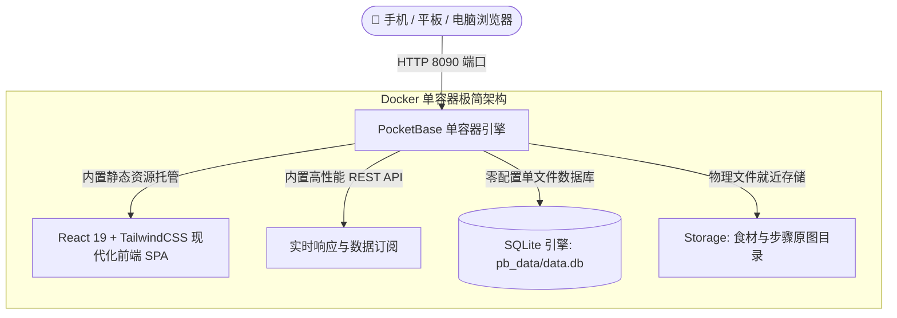

<div align="center">


# 🍱 ChowTime (饭点)

**现代化家庭菜谱管理 · 大人菜/宝宝辅食双轨分类 · 适老化长辈极简友好设计 · 烹饪指引与每日时光打卡**

*A modern, self-hosted family recipe manager & cooking journal featuring dual-track adult/baby nutrition, senior-friendly accessible UX, and an ultra-lightweight single container architecture.*

[](https://opensource.org/licenses/MIT)
[](https://pocketbase.io)
[](https://react.dev)
[](https://www.docker.com)
[](https://tailwindcss.com)

[🇨🇳 中文介绍](#-中文介绍) | [🇺🇸 English Overview](#-english-overview)

</div>

---

# 🇨🇳 中文介绍

## 📖 项目简介

**ChowTime (饭点)** 是一款专为真实家庭厨房场景打造的现代化、极轻量菜谱管理与烹饪打卡应用。

在快节奏的日常生活中，每个家庭每天最头疼的话题莫过于：*“今天吃什么？”*

目前市面上主流的开源食谱管理工具（如 Mealie、Tandoor Recipes 等）绝大多数基于西餐烹饪逻辑构建（各种烘焙温度、盎司重量单位、繁杂的多层嵌套表单），界面臃肿且不接地气；而纯文本式的菜谱指南又缺乏直观的交互与生活温度。

**《饭点》从中国家庭的实际厨房痛点出发——**
不仅有大人爱吃的经典中式家常硬菜、爽口凉拌与鲜美煲汤，**更独创了「大人菜」与「宝宝辅食」的双轨并行体系**；全站深度融入了**「适老化 / 长辈友好」**的设计语言，让不擅长使用智能手机的爷爷奶奶、外公外婆也能戴着老花镜在厨房轻松看懂、照着做，同时以“每日烹饪打卡”的形式，细心沉淀属于全家人的生活烟火气。

---

## 🌟 核心亮点与痛点卖点

### 👶 1. 宝宝分阶辅食与大人菜双轨并立（育儿家庭杀手级刚需）
- **痛点**：宝宝娇嫩的胃肠道需要严格遵循少油、无盐、少刺激的营养原则，且不同月龄（泥糊、手指食物、软烂碎面）需求迥异；传统的菜谱软件将所有菜混在一起，极易造成调味混淆或备菜手忙脚乱。
- **解法**：系统顶部支持**一键秒级切换「大人家常菜」与「宝宝营养辅食」**两大独立视界。宝宝今天该吃什么分阶辅食、大人晚上吃什么硬菜，两套逻辑清晰分明，备菜采买一清二楚。

### 👵 2. 深度适老化设计：大字号、大按钮，长辈操作零门槛
- **痛点**：大部分有娃家庭，白天都是家里的老人（爷爷奶奶/外公外婆）掌厨照顾孩子。老年人视力减弱、手指触控不够灵敏，复杂的 App 根本不会用，常常要在微信里反复语音询问“这道菜放多少盐、辅食先蒸还是先煮”。
- **解法**：
  - **大字体与高对比度排版**：老人戴着老花镜，手机放在灶台半米远也能一眼看清步骤；
  - **超大触控热区**：没有反人类的多级抽屉和细碎文字链，主干按钮清晰醒目，避免误触；
  - **直观线性做菜引导**：第 1 步切块、第 2 步焯水、第 3 步慢炖，配料用量按行清晰对齐，老人在厨房照着做省心踏实。

### 📋 3. 拒绝“少许适量”：结构化配方与保姆级图文
- 配料列表支持标准用量与换行对齐，彻底告别传统菜谱中让人抓狂的“少许、适量、凭感觉”；
- 每一道关键工序均配有真实直观的制作参考图，下厨犹如看图操作，新手也能秒变大厨。

### 🗓️ 4. 时光印记：每日烹饪打卡与家庭成长档案
- **做菜时光机**：今天做了什么菜、给宝宝尝试了哪种新食材、宝宝吃得开不开心、心得体会与满意度打分，均可一键记录；
- 随时翻阅历史打卡足迹，不仅能避免每周菜单重复单调，更能记录下孩子从辅食添加一点点长大的温馨成长史。

### 📸 5. 内置图片智能裁剪与本地极速压缩
- 手机拍摄的美食大图（通常 5MB~10MB）直接上传极易拖慢加载并挤占 NAS 空间；
- 《饭点》内置了前端交互式 Cropper 裁剪工具与智能压缩引擎，手机端上传前自动将图片无损压缩并转换为现代格式，秒传不卡顿，极度节省存储。

### ⚡ 6. 超轻量全栈单容器：内存仅 20MB 的神仙架构
- 后端与数据库采用当前顶尖的高性能 **PocketBase（单一 Go 二进制 + SQLite）**；
- 前端 React 19 静态工程与 PocketBase 完美打包为**单个极其微型的 Docker 容器**；
- **冷启动只需 0.05 秒，常驻内存仅 15MB ~ 30MB 左右**，不管是飞牛 OS、群晖、威联通、Unraid，还是性能羸弱的百元微型小主机、树莓派，都能毫无压力地开箱即用。

---

## 🔄 全栈架构一览



---

## 🚀 极速部署 (Quick Start)

### 方式 1：使用 Docker Compose（推荐）

1. 创建 `docker-compose.yml` 文件：

```yaml
version: '3.8'

services:
  chowtime:
    image: ghcr.io/dave2758/chowtime:latest # 官方云端镜像 (或本地构建: build: .)
    container_name: chowtime
    restart: unless-stopped
    ports:
      - "8090:8090"
    volumes:
      # 持久化挂载菜谱数据库与上传的食材图片
      - ./data:/pb/pb_data
```

2. 启动服务：
```bash
docker compose up -d
```

3. 打开浏览器访问：`http://你的服务器IP:8090` 即可开始使用！

---

### 方式 2：使用 Docker 命令一行运行

```bash
docker run -d \
  --name chowtime \
  --restart unless-stopped \
  -p 8090:8090 \
  -v ./data:/pb/pb_data \
  ghcr.io/dave2758/chowtime:latest
```

---

## 🔐 管理后台说明 (PocketBase Admin)

容器默认内置了 50 道精选初始家常菜谱和丰富图片。若您需要批量管理、备份数据或添加自定义字段：

1. 访问 PocketBase 专属管理后台：`http://你的服务器IP:8090/_/`；
2. 首次访问会提示创建您的第一个专属超级管理员账号（自定义邮箱与密码）；
3. 登录后即可直观管理所有集合表（`recipes`、`cooking_records` 等）。

---

## 📜 菜谱数据来源与知识产权声明 (Disclaimer)

1. 本项目内置以及演示包含的所有菜谱文字、制作步骤、食材配比及图片，均收集自**小红书、下厨房、各大美食博主及公开网络社区**热心厨友的无私分享。
2. 所有菜谱图文内容的知识产权均归**原作者所有**。
3. 本项目为开源公益非营利软件，菜谱内容仅供家庭日常烹饪参考、个人生活记录与技术开发学习，**严禁将本项目内置数据用于任何商业牟利、出版或分发行为**。
4. 若原作者对某些菜谱或图片的使用有异议，请提交 Issue 联系我们，我们将在第一时间协助处理或移除。

---

# 🇺🇸 English Overview

## 📖 Introduction

**ChowTime (饭点)** is a modern, ultra-lightweight, self-hosted family recipe manager and daily cooking journal tailored for multi-generational household kitchens.

While existing self-hosted recipe platforms (like Mealie or Tandoor Recipes) are heavily Western-centric and cluttered with complex nested configurations, **ChowTime focuses directly on the daily pain points of Asian and family households**:
- **Dual-track cooking**: Separate perspectives for adult home-cooking and low-salt/low-oil baby weaning meals.
- **Senior-first accessibility**: Thoughtfully designed with large typography, high-contrast visual cues, and generous touch targets so that grandparents cooking at home can follow every step effortlessly with zero digital anxiety.
- **Daily food diary**: Capture daily meals, track what baby ate, note lessons learned, and preserve warm family memories over time.

---

## ✨ Key Features & Highlights

- 👶 **Dual-Track Adult & Baby Recipe Management**: Instantly toggle between hearty family dishes and clean, stage-by-stage baby nutrition to keep daily meal planning organized.
- 👵 **Senior-Friendly Accessible UX**: Large typography, clean spacing, and oversized touch targets ensure older family members wearing reading glasses can comfortably follow steps from across the kitchen counter.
- 📋 **Structured Ingredients & Guided Cooking Steps**: Eliminates ambiguous "season to taste" instructions by providing line-by-line precise amounts and clear step-by-step photos.
- 🗓️ **Daily Cooking Journal & Milestone Tracking**: Log what was cooked today, capture feedback on new ingredients baby tried, and rate dishes to prevent repetitive weekly menus.
- 📸 **Smart Image Cropper & Client-Side Compression**: Interactive image cropping and automated WebP compression minimize upload latency and preserve NAS disk space.
- ⚡ **Ultra-Lightweight All-In-One Container**: Powered by PocketBase (single Go binary + SQLite) and React 19, idling at **only ~20MB of RAM** with sub-50ms cold starts.

---

## 🚀 Quick Start (Docker Compose)

```yaml
version: '3.8'

services:
  chowtime:
    image: ghcr.io/dave2758/chowtime:latest
    container_name: chowtime
    restart: unless-stopped
    ports:
      - "8090:8090"
    volumes:
      - ./data:/pb/pb_data
```

Run:
```bash
docker compose up -d
```
Access the application at `http://your-server-ip:8090`.

---

## 📜 Content Copyright & Disclaimer

1. All recipe texts, step instructions, and images bundled in the initial database are curated from publicly shared community cooking notes (such as Xiaohongshu, Xiachufang, and independent culinary bloggers).
2. Copyright and intellectual property rights belong to their **original creators**.
3. ChowTime is a non-commercial, open-source project intended exclusively for home culinary reference, personal family journaling, and educational use. Commercial use of the bundled recipes is strictly prohibited.
4. If you are a copyright holder and wish to have specific content amended or removed, please open an Issue.

---

## 📄 License

This project is licensed under the [MIT License](LICENSE).
